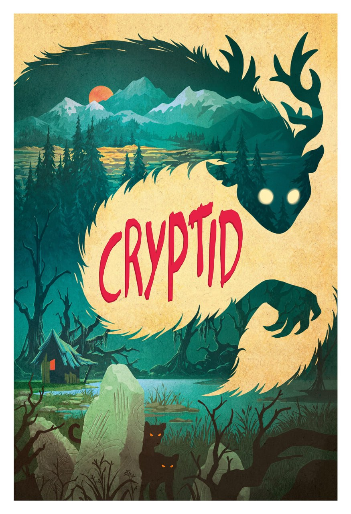
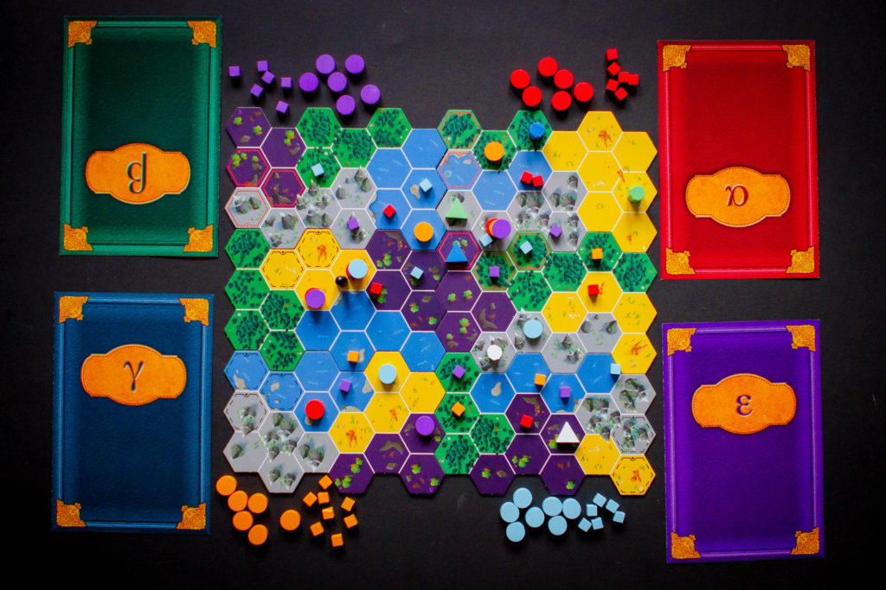
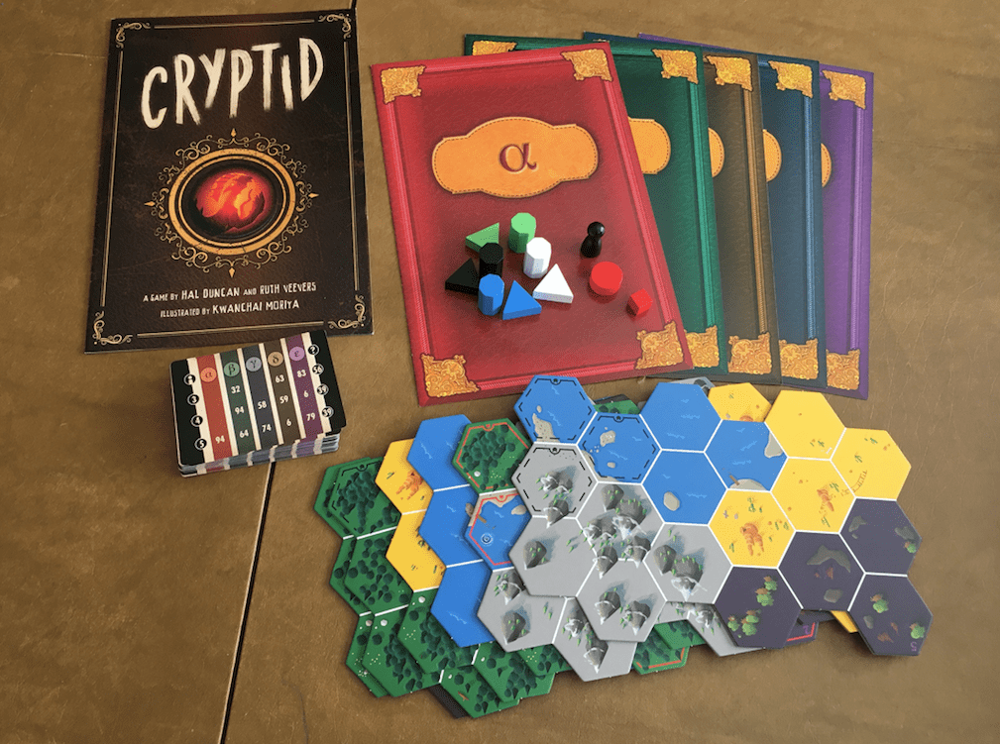

# Cryptid Web App

## Introduction

This is a group project for the Software Design (COMS3009A) module. We, the following students, have collaborated to create this project:

- Massamba Maphalala: [Massamba505](https://github.com/Massamba505)
- Siphelele Mthethwa: [SOMEONE1703](SOMEONE1703)
- Ritanzwe Mbedzi: [Ritanzwe](https://github.com/Ritanzwe)
- Kananelo Rampele: [Kanizo11](https://github.com/Kanizo11)
- Mukhunyeledzi Muthuphei: [Toby-Query](https://github.com/Toby-Query)
- Mukhathutsheli Ndou: [mucthecoder](https://github.com/mucthecoder)

Cryptid is a unique deduction game of honest misdirection in which players must try to uncover information about their opponents' clues while throwing them off the scent of their own. Each player holds one piece of evidence to help them find the creature, and on their turn, they can try to gain more information from their opponents. Be warned; give too much away and your opponents might beat you to the mysterious animal and claim the glory for themselves!

<div style="display: flex;  gap: 10px;">
    
    
    
    
</div>

## Objectives

The primary goal of this project is to develop a web-based platform that enables players to visualize, play, and customize games of Cryptid. Additionally, the application should incorporate features to support multiplayer gaming and record gameplay sessions for analysis and improvement.

## Features

1. **Board Configuration Management**
2. **Implementation of Game Logic**
3. **Multiplayer Support**
4. **Game Recording (in JSON)**
5. **Interactive Board Visualization**

## Detailed Requirements

### User Verification
- Use a 3rd party identity provider
- Two roles: Players and Admins

### Board Configuration
- Parse board configuration JSON from [Cryptid Official Site](https://www.playcryptid.com/)
- Create custom initial game states
- Customize board states

### Multiplayer
- Local hot seat multiplayer
- Optional networked multiplayer so that each player only has their relevant information visible
- Players join a game lobby through a link or code, similar to TypeRacer or Jackbox

### Recording
- Save custom game states
- Save player moves and results locally
- Implement a game viewer to replay recorded games turn by turn

### Interactive Board
- Visualize the hex board based on the game state
- Highlight valid moves for the player
- Provide a clue ‘tick list’ to deduce other players' clues
- Mouse hover tooltips for landmarks and tiles

## Getting Started

### Prerequisites

- Node.js
- npm

### Installation

1. Clone the repository
    ```sh
    git clone https://github.com/Massamba505/Cryptid-Web-App.git
    cd Cryptid-Web-App
    ```
2. Install dependencies
    ```sh
    npm install
    ```
3. Start the development server
    ```sh
    npm start
    ```

## Deployment

This project incorporates Continuous Integration and Continuous Deployment (CI-CD) principles. We are using Azure and GitHub for our deployment pipeline. The deployment process is as follows:

1. **GitHub Actions**
- We use GitHub Actions for Continuous Integration. Each push to the repository triggers a workflow that runs our test suite to ensure that all changes pass the tests.

2. **Azure Pipeline**
- The application is automatically deployed to Azure. The pipeline configuration in GitHub Actions handles the build and deployment process, ensuring that the latest version of the application is always available on our Azure server.

## Website

You can access our Cryptid Web App at: [https://playcryptidweb.azurewebsites.net](https://playcryptidweb.azurewebsites.net)

## Contact

If you have any questions or need further information, please contact us:

- Massamba Maphalala: [Massamba505](https://github.com/Massamba505)
- Siphelele Mthethwa: [SOMEONE1703](SOMEONE1703)
- Ritanzwe Mbedzi: [Ritanzwe](https://github.com/Ritanzwe)
- Kananelo Rampele: [Kanizo11](https://github.com/Kanizo11)
- Mukhunyeledzi Muthuphei: [Toby-Query](https://github.com/Toby-Query)
- Mukhathutsheli Ndou: [mucthecoder](https://github.com/mucthecoder)

